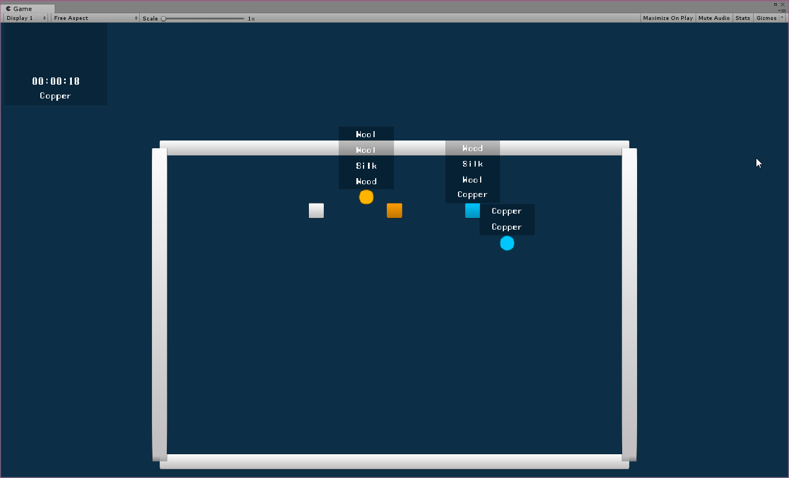
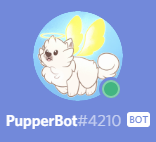

# 100 Days Of Code - Log (2nd run)

## Day 17: 2018-04-23

**Today's Progress:** [LUDUM DARE 41 JAM TIME](https://ldjam.com/events/ludum-dare/41)! Third day of the 72 hour Jam. After a little bit of (remote) work until the afternoon, we officially gave up on finishing the game. There were no chance we could ship something semi-completed, and it wouldn't made sense to do so. Instead we spent the remaining day with a retrospective on what we could have done differently, and watching [Brackeys](https://www.youtube.com/channel/UCYbK_tjZ2OrIZFBvU6CCMiA) videos (which are cool and educative as heck).

**Thoughts:** We did not gave upon the game idea: we will definitely finish it. Whether it will be the continuation of this project, or a fresh new start (maybe even in Gamemaker) is still to be decided. But definitely a fun and challenging and three days. I've learnt a lot, and of course, we WILL register for the next Jam / Compo in 4 months! (even more prepared, with even more people)

**Link to work:** *Coming soon?* [Until then, check out this clip from unfinished game.](https://streamable.com/6d6g2)

## Day 16: 2018-04-22

**Today's Progress:** [LUDUM DARE 41 JAM TIME](https://ldjam.com/events/ludum-dare/41)! Second day of the 72 hour competition. We basically got up at 8:00 AM and started working immediately. But as it turned out towards the afternoon, that we probably won't make it to the end. We were unprepared and out of practice for this challenge. Most of the hurdles came from C# itself - it works vastly different in some places from the likes of Java or Kotlin, especially we had a lot of problems implementing our architecture ideas using C# generics. So in the end a lot of time went into troubleshooting and not actual gameplay prototyping. We will continue toworrow nevertheless.

**Thoughts:** It was harder than we thought, but we were not surprised - we went into this with zero preparation. Also, iirc only I had some previous, more significant experience with Unity (university course, thesis, hobby projects). I still think Ludum Dare is not about winning, but having fun, and we definitely did that. It really moves your gears and gets you into the flow. New ideas start pouring and you get a newfound passion and motivation for programming - at least this is my opinion.

**Link to work:** *Coming soon?*

## Day 15: 2018-04-21

**Today's Progress:** [LUDUM DARE 41 JAM TIME](https://ldjam.com/events/ludum-dare/41)! We started a bit late, 1:00 PM CET (it would have started at 3:00 AM). The theme is "Combine 2 Incompatible Genres" which in my opinion is a little bit too broad. We spent most of the day brainstorming, then laying down the engine basics for our local co-op crafting/incremental game which will be made in Unity. At the end of the day, it seems our idea will be a little bit too ambitious :)

**Thoughts:** It was a ton of fun getting into the flow and start prototyping stuff with my friend in Unity! Beers and pizza were had, and we were programming for a solid 14 hours today, which I think is a good start.

**Link to work:** *Coming soon?*

## Day 14: 2018-04-19

**Today's Progress:** Tried to implement the API Key solution to the [cinegrow](https://github.com/Suppoze/cinegrow) project as [defined in this StackOverflow answer](https://stackoverflow.com/questions/48446708/securing-spring-boot-api-with-api-key-and-secret). Could not finish it today, so no commits - but will do for the next mentoring session.

**Thoughts:** I'm not gonna lie - Spring Security is not really topic I really enjoy, but I realize the importance of it. That's why I'm dedicated at (trying) to learn it's ins and outs (eventually).

**Link to work:** https://github.com/Suppoze/cinegrow

## Day 13: 2018-04-18

**Today's Progress:** Fixed some issues with the basic authentication and SSL in [cinegrow](https://github.com/Suppoze/cinegrow). Also read some posts and tutorials about Spring Security 5.

**Thoughts:** Not that much time today to prepare for tomorrow's mentoring session, but did some work nevertheless.

**Link to work:** https://github.com/Suppoze/cinegrow

## Day 12: 2018-04-17

**Today's Progress:** Worked on [cinegrow](https://github.com/Suppoze/cinegrow) - experimented with implementing basic authentication, and SSL. Not quite there yet - I want a more elegant "API key" solution instead of username + password authentication.

**Thoughts:** Today was mostly research again, but I think I'm starting to get the grasp of how to implement what I want specifically.

**Link to work:** https://github.com/Suppoze/cinegrow 

## Day 11: 2018-04-16

**Today's Progress:** Actually, decided against to continue working on my Unity game and work on my Spring Boot self-development application, [cinegrow](https://github.com/Suppoze/cinegrow). Today was mostly research, I read about how to incorporate Spring Security into the application.

**Thoughts:** Sadly I had some missing days in between, but I'm back in action. Realized I should work on my mentoring project instead, so I'll learn Spring Security in the coming days.

**Link to work:** https://github.com/Suppoze/cinegrow 

## Day 10: 2018-04-12

**Today's Progress:** NEW PROJECT! I started revising my Unity "game" for the [university course attended several years ago](https://github.com/Suppoze/flatland-unity-game). It's about time! Today I set up the required environments, and did some code cleanup & refactor to meet my improved standards since I last worked on the project.

**Thoughts:** Althought I drank a little bit of beer, I was able to squeeze in some meaningful work. That proves that some recreational drinks and programming are not exclusive!

**Link to work:** https://github.com/Suppoze/flatland-unity-game

## Day 9: 2018-04-11

**Today's Progress:** Finally, the cinema API rework is done! There's still room for improvement, but the basics are laid down. PupperBot is able to generate an embed of the movie screenings of the coming week. [Check out my PR](https://github.com/Suppoze/pupperbot-discord/pull/1) if you are curious about what's changed.

**Thoughts:** I thought I'd finish sooner with the basic cinema functionality, but nevertheless I enjoyed it a lot. I still have plans how to improve it, like choosing a specific moovie by reacting with a certain emoji (I've seen this functionality in several bots and I think it's genious). Right now the embed is waaaay to long.

Tomorrow I'll get to another project, maybe I'll start excercising with Unity, because we with my friends intend to enter the next [41st Ludum Dare Jam](https://ldjam.com/events/ludum-dare/41)! Stay tuned!

**Link to work:** https://github.com/Suppoze/pupperbot-discord/pull/1

## Day 8: 2018-04-10

**Today's Progress:** Worked on PupperBot. Finally managed to get the cinema API work with [OkHTTP](http://square.github.io/okhttp/)! It was also a very good practice for dependency inversion, I think the code is so much more well structured. Pupper managed to reply with an embed with the movie screenings, although just for one day for now - I'm planning on displaying the whole next week.

**Thoughts:** I was so prepared when I got home - I was thinking about how I'll approach this problem. Once I started, I was in the flow, and today was very productive I feel. Feels good to make visible progress now - not just screwing around with the details.

**Link to work:** https://github.com/Suppoze/pupperbot-discord/compare/dev-cinema-imp

## Day 7: 2018-04-09

**Today's Progress:** I worked on PupperBot again. I did some investigation and testing and it turns out that the current HTTP networking library I use ([Fuel](https://github.com/kittinunf/Fuel)) does not support cookie stores - and I will need that to consume the cinema API. I could have realized this sooner, but whatever. Good thing that I already started to refactor the REST clients to be more abstract, because I'll have to change the implementation. To my understanding, OkHTTP has this functionality, although it's not a pure Kotlin-focused library. No commits today though.

**Thoughts:** Well today's work was a little frustrating, but enlightening. I've learnt a lot about networking and troubleshooting. I had to whip out the good old Wireshark to investigate why it's different to make a simple GET request in Postman (which is working) and different from within the application. But in the end, today was a good day.

**Link to work:** https://github.com/Suppoze/pupperbot-discord/compare/dev-cinema-imp

## Day 6: 2018-04-07

**Today's Progress:** I fixed the path param replacer function by creating some unit tests (duh - I should TDD more...). I use JUnit 5 which just came out recently - folks say it's really good with Kotlin! I also realized that the Cinema City API rejects my requests somehow. Presumably the problem is in my code, because with Postman I ping the API without problems.

**Thoughts:** I should have been working on another projects for the weekend - I have mentoring assignments I should complete. However, I could not resist playing a little more with Kotlin, and honestly, I'd like to finish up this functionality soon.

**Link to work:** https://github.com/Suppoze/pupperbot-discord/compare/dev-cinema-imp

## Day 5: 2018-04-06

**Today's Progress:** Until I figure out the abstraction I want to implement for the Rest requests, I wanted to try out the Cinema City API itself. I managed to get some work done, but I messed up an extension function, which was meant to replace "path params" in a string (like {{0}}). So will finish it tomorrow! I also looked into how to approach testing in Kotlin, and I found a [great article](https://blog.philipphauer.de/best-practices-unit-testing-kotlin/) by Philipp Hauer.

**Thoughts:** I found out that it's sometimes easier to rather keep coding for a while and try to improve small things before starting a bigger task, just to warm you up, and give some time to think and get inspiration for the upcoming bigger work.

**Link to work:** https://github.com/Suppoze/pupperbot-discord/compare/dev-cinema-imp

## Day 4: 2018-04-05

**Today's Progress:** I use awesome [Fuel](https://github.com/kittinunf/Fuel) Kotlin lib for my HTTP requests - however I find it a little low level for my needs, so I started to build a wrapper around it - to suit my special needs (path params), and for awesome dependency inversion and abstraction. No commits today though, because it's unfinished atm. Maybe I could also go with extension functions?

**Thoughts:** It was a little late when I opened up IntelliJ, but I did not regret it. Even if squeezing a little work in, you can get into the flow rather quickly if you have a plan what you want to accomplish.

**Link to work:** https://github.com/Suppoze/pupperbot-discord/compare/dev-cinema-imp

## Day 3: 2018-04-04

**Today's Progress:** I worked on PupperBot again. I had some errands to do today so I only had time to refine some domain models for the cinema API and delete some ded code. I also had some regex practice!

**Thoughts:** Although I did not make incredible progress, I managed to learn some new regex trix, also had time to think about how I'll approach the abstraction of the Cinema City API layer.

**Link to work:** https://github.com/Suppoze/pupperbot-discord/compare/dev-cinema-imp

## Day 2: 2018-04-03

**Today's Progress:** I started implementing the new Cinema functionality into PupperBot. I'm trying to apply SOLID principles more this time, while also trying to still keep it simple (stupid).

**Thoughts:** I'm stoked - I think I made good progress. I want to finish this functionality by end of the week, hopefully I can show something by then. The eventual goal is to show movie schedules from Cinema City cinemas from any city in a nice embed. I also might implement some "commands by reactions" functionality for it - it should be interesting!

**Link to work:** https://github.com/Suppoze/pupperbot-discord/compare/dev-cinema-imp

## Day 1: 2018-04-01

**Today's Progress:** I just updated some dependencies for my pupperbot-discord project, to prepare for some work tomorrow.

**Thoughts:** Feels good to be back at it again - I'll motivated to try the 100DaysOfCode challange again - I think the most important lesson I've learnt from last time is that I should not overcommit to this challenge to the point it becomes cumbersome and burnout-heavy, I'll do it little by little.

**Link to work:** https://github.com/Suppoze/pupperbot-discord
