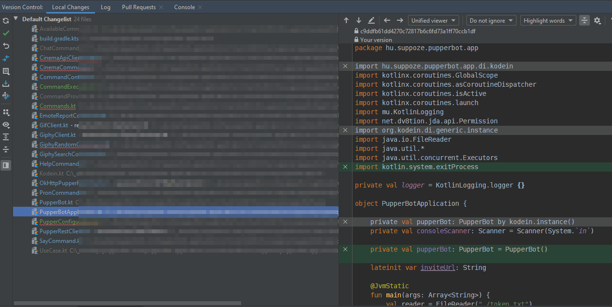

# 100 Days Of Code - Log (3rd run)

## Day 16: 2019-12-10

**Today's Progress:** Same as yesterday: the changelist is just growing and growing! I think it will be at least 3-4 days until I can run PupperBot "2.0" again. Having so much fun! But as it turns out, livign without a service locator or "dependency injection" like Kodein is harder than I thought. But that just encourages me to come up with a clever and clean way of providing dependencies.

Like defining the application profile with a DSL? Hmm...

**Link to work:** https://github.com/zsoki/pupperbot-discord

## Day 15: 2019-12-09

**Today's Progress:** I was really in the flow today while refactoring PupperBot, honestly reading [Marcin Moskala's recently released Effective Kotlin book](https://leanpub.com/effectivekotlin) made me realize so many past mistakes and gave me such a huge inspiration... It's awesome. I'm not gonna go into details, but I have decided on some principles for this project:

- Less is more, so get rid of unnecessary depencendies
- Similarly, limitation is the mother of creativity

So I am getting rid of KodeIn, the DI dependency I've been using in the project. I've realized that because the project is really small, it's not necessary - I should exercise good practices and clean code instead.

**Materials:** [Marcin Moskala - Effective Kotlin](https://leanpub.com/effectivekotlin)

**Link to work:** https://github.com/zsoki/pupperbot-discord

## Day 14: 2019-12-06

**Today's Progress:** Unfortunately I was really busy in recent days, but today I managed to get rid of some old unused dependencies and functionalities in PupperBot. I want to do a semi-clean start!

I was also watching the [Kotlin Conference 2019](https://kotlinconf.com/), so I'm really motivated to continue with PupperBot and have some fun with Kotlin :)

**Link to work:** https://github.com/zsoki/pupperbot-discord

## Day 13: 2019-12-03

**Today's Progress:** Finally! The updated PupperBot is up and running on local! Breaking changes introduced with dependency updates fixed. But looking at the project, I think I need some big refactors and to Y E E T some useless code. Tomorrow, I'll set some milestones!

**Link to work:** https://github.com/zsoki/pupperbot-discord

## Day 12: 2019-12-02

**Today's Progress:** Okay turns out there was still stuff to do with the Gradle Kotlin DSL migration. But it seems like everything is working now! Also cleaned up the project in general, like I don't know why but some of the IntelliJ project generated files were pushed to the repository which can cause major issues and weird stuff in a Gradle/Maven managed project...

Coming up: Now that I have all of my dependencies updated, I can work on the breaking changes for all the libs, gonna be fun!

**Link to work:** https://github.com/zsoki/pupperbot-discord

## Day 11: 2019-12-01

**Today's Progress:** Finally finished migrating the Gradle script to Kotlin DSL for PupperBot! The only thing missing is handling extra properties like you could in the Groovy script. But I think I'll rather just use [jmfayard's buildSrcVersions Gradle plugin](https://github.com/jmfayard/gradle-dependencies-plugins) - it provides much better dependency version management!

Coming up: updating all of the dependencies of PupperBot...

**Link to work:** https://github.com/zsoki/pupperbot-discord

## Day 10: 2019-11-29

**Today's Progress:** Turns out the shadow plugin for Gradle is causing issues, it does not support Gradle 6.x yet. That was not the only issue though. I still have some work left with migrating the build script to the Gradle Kotlin DSL, will continue tomorrow!

**Link to work:** https://github.com/zsoki/pupperbot-discord

## Day 9: 2019-11-28

**Today's Progress:** I was still struggling with updating dependencies in the PupperBot project, when I realized that at some point, for some reason, I overwrote the Gradle settings in IntelliJ, so it did not use the gradle wrapper, but rather an outdated distribution installed. Nevertheless, after realizing this mistake I started migrating the gradle scripts and the whole project to Gradle 6.0.1 and using Kotlin DSL scripts. It's fun so far!

**Link to work:** https://github.com/zsoki/pupperbot-discord

## Day 8: 2019-11-27

**Today's Progress:** Today I wanted to work on my Discord bot called [PupperBot](https://github.com/zsoki/pupperbot-discord). So far I just struggled with Gradle and spent some time with research on which embedded database solution should I use for some new features. Because I want to persist the data to local storage as well, [Nitrite](https://www.dizitart.org/nitrite-database/) looks quite intriguing! I shall try it tomorrow.

**Link to work:** https://github.com/zsoki/pupperbot-discord

## Day 7: 2019-11-26

**Today's Progress:** Fixed the NPE, yaay! I guess I need to look into the order of ScriptableObject vs. MonoBehaviour lifecycle. Seemed like Start() for the MonoBehaviour ran before the ScriptableObject's Awake()?

For now, the NPE is fixed by initializing the property lazily, but it's not perfect because it does depend on other properties being initialized...

**Link to work:** https://github.com/zsoki/match-three-project

## Day 6: 2019-11-25

**Today's Progress:** Rewatched parts of the video from the previous day, and I tought of a way to track the gems on the board using the something similar of the RuntimeSet pattern described in the presentation. RuntimeSet2D will have horizontal and vertical dimensions which are set by IntVariable scriptable objects.

Most of it is done, but still getting NullPointerExceptions... Will get to fixing it tomorrow!

**Link to work:** https://github.com/zsoki/match-three-project

## Day 5: 2019-11-24

**[Link to Tweet with video](https://twitter.com/zsoki_/status/1198649212461879296)**

**Today's Progress:** Managed to get the scaling of the gems to work, and also started the gem dragging logic. I have some good ideas on how to continue with the movement of other gems as well!

**Materials:** I also watched [Ryan Hipple's amazing talk about game architecture using ScriptableObjects](https://www.youtube.com/watch?v=raQ3iHhE_Kk) which I highly recommend. It was eye opening and really made me think on how to structure my game.

**Link to work:** https://github.com/zsoki/match-three-project

## Day 4: 2019-11-22

**Today's Progress:** Ditched the scaling for a bit, instead I'm trying to implement a generic data structure for the gems, so that I don't need a prefab for every gem color (and behaviour) later. Trying ScriptableObjects, but not sure it is what I need.

**Link to work:** https://github.com/zsoki/match-three-project

## Day 3: 2019-11-20

**Today's Progress:** Tried to implement scaling of the gems on mouse enter and mouse exit. Unfortunately I did not quite get it...

**Thoughts:** Last couple of days were busy, so I could not spend time with the challange. But I'm always happy when I can sit down a little, even for a little brainstorm!

**Link to work:** https://github.com/zsoki/match-three-project

## Day 2: 2019-11-14

**Today's Progress:** Implemented a basic board generation script.

**Thoughts:** Progress feels good! I'm not really satisfied with the gems though, I think the they should be more generic, and not each of them should be a separate prefab.

**Link to work:** https://github.com/zsoki/match-three-project

## Day 1: 2019-11-13

**Today's Progress:** I want to play with Unity again... I have an idea for a match 3 game with a twist. I downloaded the alpha for Unity 2020.1, grabbed some free assets and started the project today! Wish me luck!

**Thoughts:** Feeling excited!

**Link to work:** Soon
