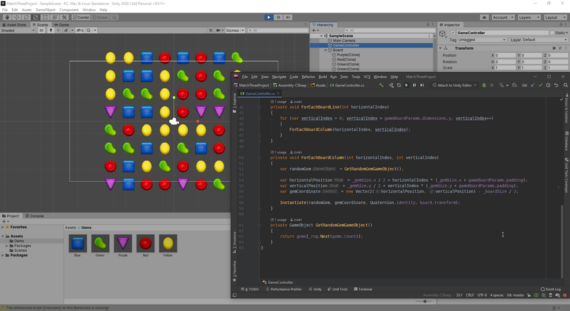
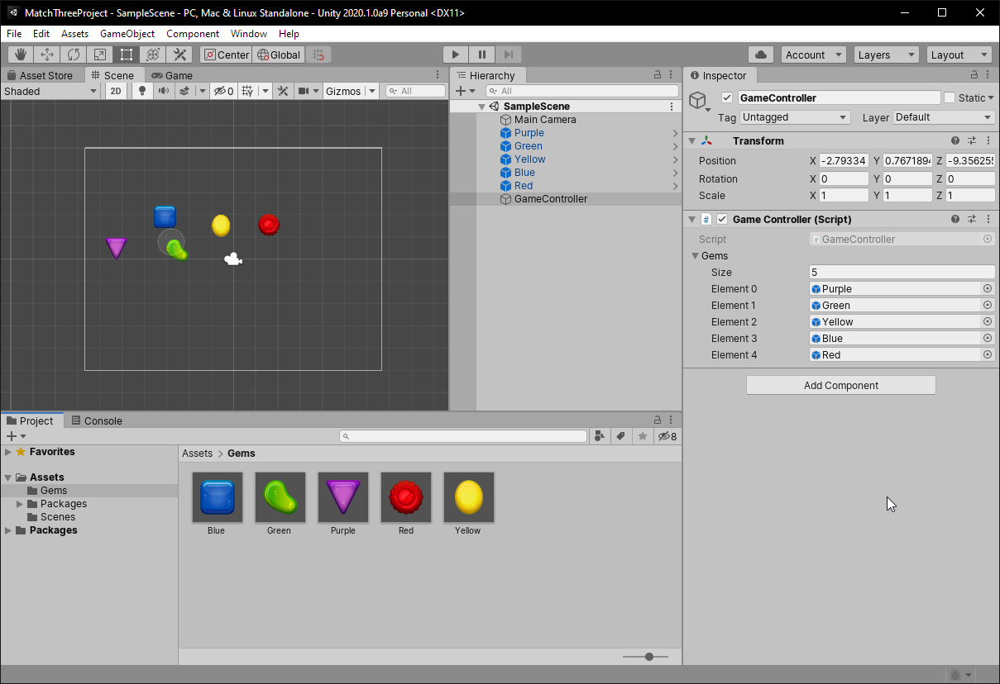

# 100 Days Of Code - Log (3rd run)

## Day 7: 2019-11-26

**Today's Progress:** Fixed the NPE, yaay! I guess I need to look into the order of ScriptableObject vs. MonoBehaviour lifecycle. Seemed like Start() for the MonoBehaviour ran before the ScriptableObject's Awake()?

For now, the NPE is fixed by initializing the property lazily, but it's not perfect because it does depend on other properties being initialized...

**Link to work:** https://github.com/zsoki/match-three-project

## Day 6: 2019-11-25

**Today's Progress:** Rewatched parts of the video from the previous day, and I tought of a way to track the gems on the board using the something similar of the RuntimeSet pattern described in the presentation. RuntimeSet2D will have horizontal and vertical dimensions which are set by IntVariable scriptable objects.

Most of it is done, but still getting NullPointerExceptions... Will get to fixing it tomorrow!

**Link to work:** https://github.com/zsoki/match-three-project

## Day 5: 2019-11-24

**[Link to Tweet with video](https://twitter.com/zsoki_/status/1198649212461879296)**

**Today's Progress:** Managed to get the scaling of the gems to work, and also started the gem dragging logic. I have some good ideas on how to continue with the movement of other gems as well!

**Materials:** I also watched [Ryan Hipple's amazing talk about game architecture using ScriptableObjects](https://www.youtube.com/watch?v=raQ3iHhE_Kk) which I highly recommend. It was eye opening and really made me think on how to structure my game.

**Link to work:** https://github.com/zsoki/match-three-project

## Day 4: 2019-11-22

**Today's Progress:** Ditched the scaling for a bit, instead I'm trying to implement a generic data structure for the gems, so that I don't need a prefab for every gem color (and behaviour) later. Trying ScriptableObjects, but not sure it is what I need.

**Link to work:** https://github.com/zsoki/match-three-project

## Day 3: 2019-11-20

**Today's Progress:** Tried to implement scaling of the gems on mouse enter and mouse exit. Unfortunately I did not quite get it...

**Thoughts:** Last couple of days were busy, so I could not spend time with the challange. But I'm always happy when I can sit down a little, even for a little brainstorm!

**Link to work:** https://github.com/zsoki/match-three-project

## Day 2: 2019-11-14

**Today's Progress:** Implemented a basic board generation script.

**Thoughts:** Progress feels good! I'm not really satisfied with the gems though, I think the they should be more generic, and not each of them should be a separate prefab.

**Link to work:** https://github.com/zsoki/match-three-project

## Day 1: 2019-11-13

**Today's Progress:** I want to play with Unity again... I have an idea for a match 3 game with a twist. I downloaded the alpha for Unity 2020.1, grabbed some free assets and started the project today! Wish me luck!

**Thoughts:** Feeling excited!

**Link to work:** Soon
