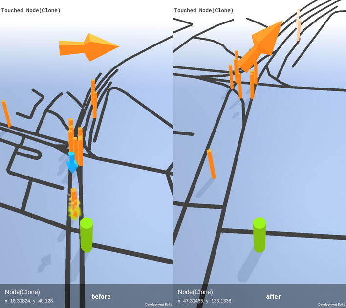

# 100 Days Of Code - Log

## Day 19: March 7th, 2017

**Today's Progress**: Decided to focus on adjusting the player position in a way that the player is put on the nearest road. After a bit of thinking I tried an implementation of this, but I think I'm slightly off-track about this problem. So no good solution yet.
Also, it might be necessary to do so refactoring, because in order to have fast visible progress, I often neglect good coding patterns, and it is getting a little hard to maintain. So tomorrow I'll get to refactoring some of the classes.

**Thoughts:** As you can see, I kind of failed so far with this challenge. But I want to continue, and do not plan to abandon this project or delete this repository. My reasoning is that I should be held accountable for my progress, even if it's not the best.
I'm a little disappointed in myself that I didn't do better because I definitely could, but it has been hard nowadays. Anyways, it seems like I'll be updating daily from now on because I'm on a tight deadline with my thesis and I'll need to focus.
Also, I'm thinking about extending this challenge for myself in the future by adding days that make up for the days I missed so far. Which carries the risk of never completing the challenge by the way, but that way I at least have a way to redeem myself in the future. We'll see.

**Link to work:** [Labyrinth-Thesis](https://github.com/Suppoze/Labyrinth-Thesis)

## Day 18: March 6th, 2017

**Today's Progress**: Today I spent a lot of time troubleshooting Unity. I installed the latest beta because I heard that the [bug that has preventing me from upgrading Unity  since January has been fixed in 5.6](https://issuetracker.unity3d.com/issues/android-location-app-crashes-due-to-error-jstring-has-wrong-type-android-dot-location-dot-location).
But as I tried building the project with the new version, the process always hanged at packaging shared assets, no matter how much time I gave it. After a lot of trial and error I realized that none of the beta versions can build my project at the moment, so I installed the latest stable version. I later realized that it also got a patch which fixed this particular bug, so it was a big facepalm moment.
I also set up Unity Remote 5 on my Android device for faster debugging, which I do not know how I lived without so far. So I got to clean up some *#if UNITY_EDITOR* preprocessor directives.

**Thoughts:** This is part of a late update (writing this on March 7th). More thoughts on that daily update.

**Link to work:** [Labyrinth-Thesis](https://github.com/Suppoze/Labyrinth-Thesis)

## Day 17: February 28th, 2017

**Today's Progress**: Today I can show you how the corridors look like so far, they are pretty plain, but I learned a lot during the creation of these, namely how to create custom meshes, set the normals for the triangles and and adjust the UV map values. Still, the result is kinda lackluster, but I think I can improve it by adding an outside wall to the corridor - this way the corridor itself can cast shadows for the inside, which should improve the appearance slightly.

**Thoughts:** This is part of a late update (writing this on March 7th). More thoughts on that daily update.

**Link to work:** [Labyrinth-Thesis](https://github.com/Suppoze/Labyrinth-Thesis)

## Day 16: February 27th, 2017

**Today's Progress**: Started thinking about and planning the implementation of the corridor rendering in my "labyrinth" geocaching app. Not much of a visible progress so far. The plan is to generate really simple corridors from meshes manually, for now without rounding the corners on turns and intersections.

**Thoughts:** This is part of a late update (writing this on March 7th). More thoughts on that daily update.

**Link to work:** [Labyrinth-Thesis](https://github.com/Suppoze/Labyrinth-Thesis)

## Day 15: February 17th, 2017

**Today's Progress**: Worked again on my thesis. Added an indicator for the collider around the player where a nearby node can be selected, also some smaller fixes and stuff.

**Thoughts:** This is part of a late update (writing this on March 7th). More thoughts on that daily update.

**Link to work:** [Labyrinth-Thesis](https://github.com/Suppoze/Labyrinth-Thesis)

## Day 14: February 9th, 2017

**Today's Progress**: Added [ROME library](https://rometools.github.io/rome/) to my Discord bot in order to process RSS feeds, and post updates in chat in embedded form. Also moved around some stuff for better organization. Also tried deploying the bot to my RPi, which was a failure.

**Thoughts:** The RSS feed reader is still very much work in progress. I have to think about how to cache the feeds, and how to check for updated periodically. It will be a good challenge. I'll probably need some kind of persistent database. Maybe SQLite?

**Link to work:** [PupperBot-Discord](https://github.com/Suppoze/pupperbot-discord)

## Day 13: February 8th, 2017

**Today's Progress**: Today I worked on PupperBot. I'm integrating a dependency injection library for Kotlin called [Kodein](https://salomonbrys.github.io/Kodein/). Only scratching the surface, but looks pretty promising!

**Thoughts:** Decided to come back to improving my Discord bot. I want to make a solid foundation if I want to implement some more demanding features in the future. Like image macro generation, or RSS reader (I think I will start with the latter). Also, I want to deploy it to my Raspberry Pi.

**Link to work:** [PupperBot-Discord](https://github.com/Suppoze/pupperbot-discord)

## Day 12: February 3nd, 2017

**Today's Progress**: Today I started working on implementing the game area in my geocaching app. This is represented with a "force field" on the map. I also spent a lot of time fiddling around in Blender, I needed a more detailed cylinder than the built-in Unity map.

**Thoughts:** The idea behind this game area that you can only activate nodes within it, and you cannot leave this area. I think even if I haven't made a lot a progress today, I've learnt a lot. Blender is hard, but fun. Learned a lot about UV mapping! Screenshot tomorrow.

**Link to work:** [Labyrinth-Thesis](https://github.com/Suppoze/Labyrinth-Thesis)

## Day 11: February 2nd, 2017

**Today's Progress**: Today I worked on my geocaching app again. Realized why my latitude-longitude normalization was way off, so I reimplemented it using [equirectangular projection](https://en.wikipedia.org/wiki/Equirectangular_projection). Seems like this feature won't need any more attention (for now).

Difference: (the arrow is a little cray cray now)

**Thoughts:** Brought myself into fixing a long-lasting bug with my thesis, so when I work again on it, I can focus on the more fun stuff. I'll put PupperBot on hold for now. Also, longest streak yet (which is a shame, but whatevs)

**Link to work:** [Labyrinth-Thesis](https://github.com/Suppoze/Labyrinth-Thesis)

## Day 10: February 1st, 2017

**Today's Progress**: Not much progress today, just added RxJava and changed the Giphy request to to return Observables. It was really easy, like this Fuel library so far!

**Thoughts:** Now that's done, I think I'll rethink the app a little to utilize the reactive approach further. I could implement an RSS module perhaps?

**Link to work:** [PupperBot-Discord](https://github.com/Suppoze/pupperbot-discord)

## Day 9: January 31th, 2017

**Today's Progress**: Added the [Fuel HTTP networking library](https://github.com/kittinunf/Fuel) to my Discord bot, in order to implement basic Giphy functions. Now you can get a random gif limited by a tag, by ";giphy tag". Also made some improvements to the structure of the project.

**Thoughts:** I think I need to improve the architecture further, for example I'm planning on adding Dagger2 for easy dependency injection, and I also want to make use of RxJava, because both Discord4J and Fuel could benefit from it.

**Link to work:** [PupperBot-Discord](https://github.com/Suppoze/pupperbot-discord)

## Day 8: January 25th, 2017

**Today's Progress**: Started another project: wanted to make a Discord Bot. So I set up the application on the Discord developer console, and put together a very basic bot called PupperBot. It'll be written in Kotlin language, using the Discord4J library. Currently it can only reply, and change the "Playing" status.

**Thoughts:** This is something I've been wanting to try, and it turns out, it's not that hard to start out. Also it was a refreshing session, Kotlin is something I've been neglecting nowadays. I plan to teach lil' PupperBot some fun stuff in the near future! But beforehand, I'll need to think about how to structure this project.

**Link to work:** [PupperBot-Discord](https://github.com/Suppoze/pupperbot-discord)

## Day 7: January 24th, 2017

**Today's Progress**: Improved node selection and highlighting nodes in range. Nothing visually demonstrative.

**Thoughts:** I won't even mention how many days I left out. I'm starting to think I'm approaching this challenge wrong - I won't do it because I want to do something significant, which takes more than one hour, and I find it harder to make myself do it. But if I lower my expectations of myself and be content with doing smaller improvements, then maybe I can maintain the (close to) daily routine.

**Link to work:** [Labyrinth-Thesis](https://github.com/Suppoze/Labyrinth-Thesis)

## Day 6: January 18th, 2017

**Today's Progress**: Decided to make the change I was thinking about the other day, so I implemented a touch listener, to be able to interact with the nodes. Also, I added a little blue selection arrow above the currently selected node, which is managed by a selection controller.
The node info bar and node highlighting will need a rework now.

[See my Twitter post for a quick demo!](https://twitter.com/suppoze/status/821771988087799811)

**Thoughts:** Hard to get the everyday habit going, but I hope I can keep it up from now on. To be honest, I still exercise and learn more since I started participating. So overall I feel good, but also I could do better. Slowly, but steadily I'm aiming to improve.

**Link to work:** [Labyrinth-Thesis](https://github.com/Suppoze/Labyrinth-Thesis)

## Day 5: January 13th, 2017

**Today's Progress**: Made some effects for the nodes that are in reach, also an info popup. Also made a button for cycling through nearby nodes, although it might need some rework.

**Thoughts:** Really great progress overall, but I'm not sure about the cycle mechanic yet. The point is that there will be a specific node you have to get to and activate, maybe I will rework the cycle button to be "Activate", and you can simply select a node by tapping on it in the world. And make the particle effect appear on all nodes within reach (which are selectable) and add another indicator for the selected node. I'll think about tomorrow.

**Link to work:** [Labyrinth-Thesis](https://github.com/Suppoze/Labyrinth-Thesis)

## Day 4: January 12th, 2017

**Today's Progress**: Still had some issues with Unity versions, but in the end, I managed to restore a working project. This took a sizable amount of time, but I could spend some time with upgrading the visuals a little, I also added some status messages.

**Thoughts:** I am relieved that I can finally leave this problem behind, seems like I can focus on more fun parts of the project in the future.

**Link to work:** [Labyrinth-Thesis](https://github.com/Suppoze/Labyrinth-Thesis)

## Day 3: January 10th, 2017

**Today's Progress**: Successfully identified the problem which was causing builds to crash on Android: it was related to Unity's location service. As it turns out, [it is a bug in Unity 's implementation itself!](https://issuetracker.unity3d.com/issues/android-location-app-crashes-due-to-error-jstring-has-wrong-type-android-dot-location-dot-location). Luckily, the initial commit I made on GitHub was with a working version.

**Thoughts:** This day was a huge bummer but also a big relief. This crash really demotivated me, so that's why I went on a 3-4 day hiatus from #100DaysOfCode. But now I feel I can make progress again from tomorrow!

**Link to work:** [Labyrinth-Thesis](https://github.com/Suppoze/Labyrinth-Thesis)

## Day 2: January 6th, 2017

**Today's Progress**: Sadly, Unity refused to build a working version of the app today, I am still investigating what is causing the problem. Other than that, I tried to tweak the coordinate normalization further.

**Thoughts:** I think I made a serious issue while working with the nodes gotten from OpenStreetMap, because the generated map is still slightly deformed, doesn't matter how I approach it. Might be a rounding problem, which if it is, I need to dig deeper. Anyways, I will work on something more fun part of this project tomorrow.

**Link to work:** [Labyrinth-Thesis](https://github.com/Suppoze/Labyrinth-Thesis)

## Day 1: January 5th, 2017

**Today's Progress**: Today I spent a good 2-3 hours to fix a coordinate normalization problem I noticed: the nodes where not scaled properly on one axis.

**Thoughts:** I already had a serious project going on, namely my thesis which should be finished soon. So I decided to go back to it after a long hiatus. It's supposed to be a geocaching game when it's done (or something like that).

**Link to work:** [Labyrinth-Thesis](https://github.com/Suppoze/Labyrinth-Thesis)
