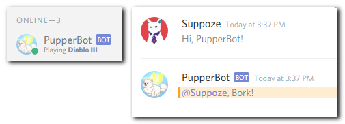
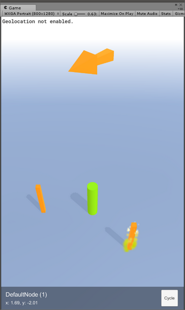

# 100 Days Of Code - Log

## Day 9: January 31th, 2017

**Today's Progress**: Added the Fuel HTTP networking library to my Discord bot, in order to implement basic Giphy functions. Now you can get a random gif limited by a tag, by ";giphy tag". Also made some improvements to the structure of the project.

**Thoughts:** I think I need to improve the architecture further, for example I'm planning on adding Dagger2 for easy dependency injection, and I also want to make use of RxJava, because both Discord4J and Fuel could benefit from it.

**Link to work:** [PupperBot-Discord](https://github.com/Suppoze/pupperbot-discord)

## Day 8: January 25th, 2017

**Today's Progress**: Started another project: wanted to make a Discord Bot. So I set up the application on the Discord developer console, and put together a very basic bot called PupperBot. It'll be written in Kotlin language, using the Discord4J library. Currently it can only reply, and change the "Playing" status.

**Thoughts:** This is something I've been wanting to try, and it turns out, it's not that hard to start out. Also it was a refreshing session, Kotlin is something I've been neglecting nowadays. I plan to teach lil' PupperBot some fun stuff in the near future! But beforehand, I'll need to think about how to structure this project.

**Link to work:** [PupperBot-Discord](https://github.com/Suppoze/pupperbot-discord)

## Day 7: January 24th, 2017

**Today's Progress**: Improved node selection and highlighting nodes in range. Nothing visually demonstrative.

**Thoughts:** I won't even mention how many days I left out. I'm starting to think I'm approaching this challenge wrong - I won't do it because I want to do something significant, which takes more than one hour, and I find it harder to make myself do it. But if I lower my expectations of myself and be content with doing smaller improvements, then maybe I can maintain the (close to) daily routine.

**Link to work:** [Labyrinth-Thesis](https://github.com/Suppoze/Labyrinth-Thesis)

## Day 6: January 18th, 2017

**Today's Progress**: Decided to make the change I was thinking about the other day, so I implemented a touch listener, to be able to interact with the nodes. Also, I added a little blue selection arrow above the currently selected node, which is managed by a selection controller.
The node info bar and node highlighting will need a rework now.

[See my Twitter post for a quick demo!](https://twitter.com/suppoze/status/821771988087799811)

**Thoughts:** Hard to get the everyday habit going, but I hope I can keep it up from now on. To be honest, I still exercise and learn more since I started participating. So overall I feel good, but also I could do better. Slowly, but steadily I'm aiming to improve.

**Link to work:** [Labyrinth-Thesis](https://github.com/Suppoze/Labyrinth-Thesis)

## Day 5: January 13th, 2017

**Today's Progress**: Made some effects for the nodes that are in reach, also an info popup. Also made a button for cycling through nearby nodes, although it might need some rework.

**Thoughts:** Really great progress overall, but I'm not sure about the cycle mechanic yet. The point is that there will be a specific node you have to get to and activate, maybe I will rework the cycle button to be "Activate", and you can simply select a node by tapping on it in the world. And make the particle effect appear on all nodes within reach (which are selectable) and add another indicator for the selected node. I'll think about tomorrow.

**Link to work:** [Labyrinth-Thesis](https://github.com/Suppoze/Labyrinth-Thesis)

## Day 4: January 12th, 2017

**Today's Progress**: Still had some issues with Unity versions, but in the end, I managed to restore a working project. This took a sizable amount of time, but I could spend some time with upgrading the visuals a little, I also added some status messages.

**Thoughts:** I am relieved that I can finally leave this problem behind, seems like I can focus on more fun parts of the project in the future.

**Link to work:** [Labyrinth-Thesis](https://github.com/Suppoze/Labyrinth-Thesis)

## Day 3: January 10th, 2017

**Today's Progress**: Successfully identified the problem which was causing builds to crash on Android: it was related to Unity's location service. As it turns out, [it is a bug in Unity 's implementation itself!](https://issuetracker.unity3d.com/issues/android-location-app-crashes-due-to-error-jstring-has-wrong-type-android-dot-location-dot-location). Luckily, the initial commit I made on GitHub was with a working version.

**Thoughts:** This day was a huge bummer but also a big relief. This crash really demotivated me, so that's why I went on a 3-4 day hiatus from #100DaysOfCode. But now I feel I can make progress again from tomorrow!

**Link to work:** [Labyrinth-Thesis](https://github.com/Suppoze/Labyrinth-Thesis)

## Day 2: January 6th, 2017

**Today's Progress**: Sadly, Unity refused to build a working version of the app today, I am still investigating what is causing the problem. Other than that, I tried to tweak the coordinate normalization further.

**Thoughts:** I think I made a serious issue while working with the nodes gotten from OpenStreetMap, because the generated map is still slightly deformed, doesn't matter how I approach it. Might be a rounding problem, which if it is, I need to dig deeper. Anyways, I will work on something more fun part of this project tomorrow.

**Link to work:** [Labyrinth-Thesis](https://github.com/Suppoze/Labyrinth-Thesis)

## Day 1: January 5th, 2017

**Today's Progress**: Today I spent a good 2-3 hours to fix a coordinate normalization problem I noticed: the nodes where not scaled properly on one axis.

**Thoughts:** I already had a serious project going on, namely my thesis which should be finished soon. So I decided to go back to it after a long hiatus. It's supposed to be a geocaching game when it's done (or something like that).

**Link to work:** [Labyrinth-Thesis](https://github.com/Suppoze/Labyrinth-Thesis)
